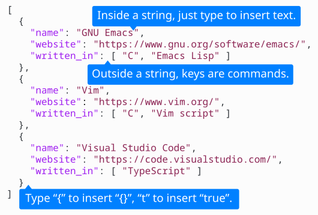
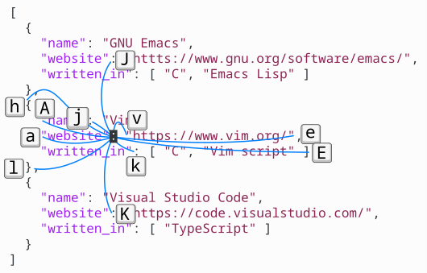
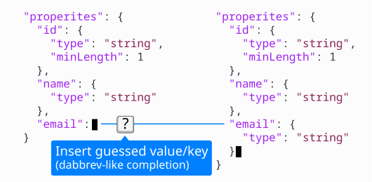
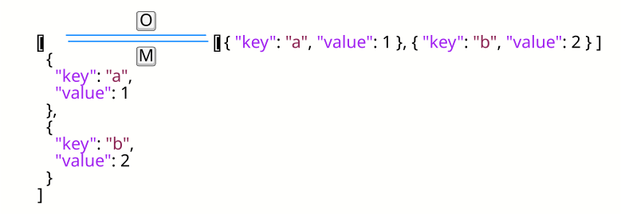

[![License GPL 3][badge-license]][copying]
[![Run Tests][badge-run-test]][action-run-test]
<!-- [](https://melpa.org/#/json-par) -->
<!-- [](https://melpa.org/#/json-par) -->

# JSON Par mode

Emacs minor mode for structural editing of JSON, inspired by [`lispy`](https://github.com/abo-abo/lispy).


## Features

- [Ctrl-less, yet modeless](https://www.tatapa.org/~takuo/json-par/manual.html#ctrl-less-yet-modeless)

  

- [Structural movement](https://www.tatapa.org/~takuo/json-par/manual.html#structural-movement)

  

- [`dabbrev`-like completion](https://www.tatapa.org/~takuo/json-par/manual.html#completion)

  

- [Converting single-line to/from multiline](https://www.tatapa.org/~takuo/json-par/manual.html#single-line-and-multiline)

  

- [Cloning members](https://www.tatapa.org/~takuo/json-par/manual.html#cloning)

- [Marking/deleting various things](https://www.tatapa.org/~takuo/json-par/manual.html#mark-and-delete)

- And More!

See the [manual](https://www.tatapa.org/~takuo/json-par/manual.html) for details.


## Installation

Install `json-par` package from MELPA.

To install without MELPA, download [latest release](https://github.com/taku0/json-par/releases) and execute `M-x package-install-file` for the .tar archive.

Then add the following line to your `.emacs`:

```elisp
(add-hook 'json-mode-hook (lambda () (json-par-mode 1)))
```

Enabling [`aggressive-indent-mode`](https://github.com/Malabarba/aggressive-indent-mode) is also recommended.

### Using only one or two functions

If you feel JSON Par mode officious, you can just pick a few functions and bind them to key sequences you like.  Example:

```elisp
(require 'json-mode)
(require 'json-par-mode)
(define-key json-mode-map (kbd "M-/") #'json-par-insert-guessed)
(define-key json-mode-map (kbd "C-c a") #'json-par-beginning-of-member)
(define-key json-mode-map (kbd "C-c e") #'json-par-end-of-member)
(define-key json-mode-map (kbd "C-c c") #'json-par-clone-member-forward)
```


## Hacking

To build the package locally, run `make package`.

To install the built package, run `make install`.

To run tests, run `make test`.

Make sure to run `make lint` before submitting a pull request.

For other commands, run `make help`.

## About comments

Supporting comments with `jsonc-mode` is a hidden feature and intentionally undocumented.  It may not work for some cases.


## Related projects

- [lispy](https://github.com/abo-abo/lispy): `json-par` is a `lispy` for JSON.
- [Paredit Mode](http://mumble.net/~campbell/emacs/paredit.el): “JSON Par mode” is named after Paredit Mode.
- [Puni](https://github.com/AmaiKinono/puni): Generic structured editing for many modes.
- [Symex mode](https://github.com/countvajhula/symex.el): Structural editing for Lisp.


## Acknowledgments

`json-par` is inspired from [`lispy`](https://github.com/abo-abo/lispy).

[Full list of contributors](https://github.com/taku0/json-par/graphs/contributors).


## License

GPLv3. See [COPYING][] for details. Copyright (C) 2021 taku0.

[badge-license]: https://img.shields.io/badge/license-GPL_3-green.svg
[badge-run-test]: https://github.com/taku0/json-par/workflows/Run%20Tests/badge.svg
[action-run-test]: https://github.com/taku0/json-par/actions?query=workflow%3A%22Run+Tests%22
[COPYING]: ./COPYING
